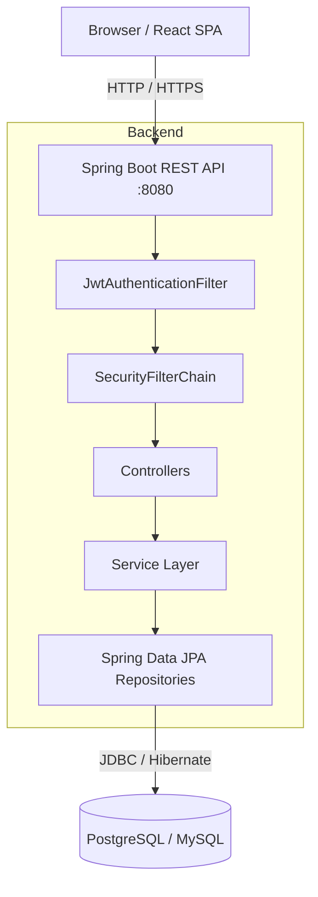
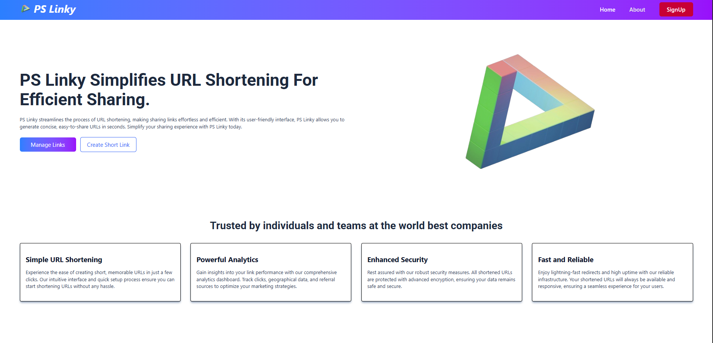
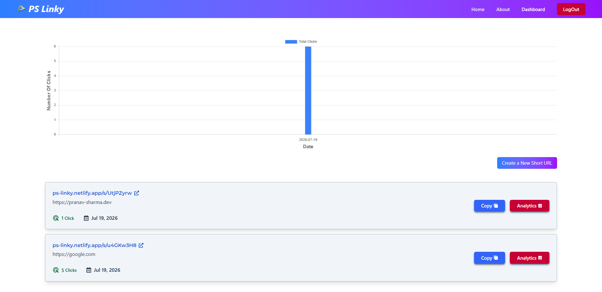
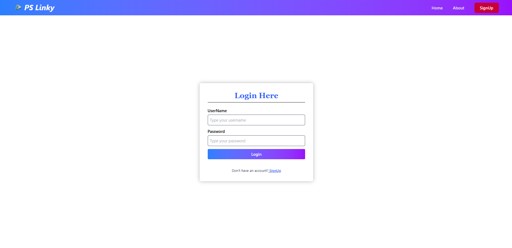
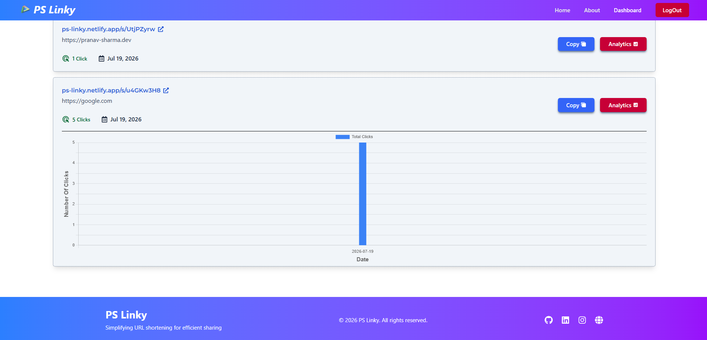
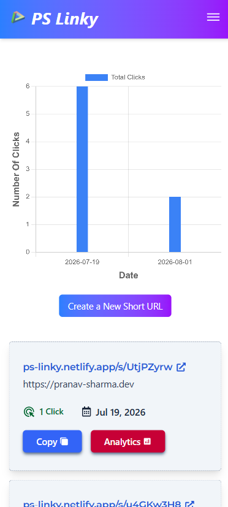

<h1 align="center">PS Linky — URL Shortener</h1>

<h4 align="center">Simplifying URL shortening for efficient sharing.</h4>

<p align="center">
  A full-stack, production-ready URL shortening application built to convert long, unwieldy URLs into compact, trackable, and shareable 8-character links in seconds. 
</p>

<p align="center">
  
  
  
  
  
  
  
  
  
  
  
</p>

---

<p align="center">
  
</p>

---

## 📑 Table of Contents

- [Overview](#-overview)
- [Features](#-features)
- [Tech Stack](#-tech-stack)
- [Architecture](#-architecture)
- [Screenshots](#-screenshots)
- [Folder Structure](#-folder-structure)
- [Getting Started](#-getting-started)
- [Installation](#-installation)
- [Docker](#-docker)
- [Environment Variables](#-environment-variables)
- [API Overview](#-api-overview)
- [Authentication](#-authentication)
- [Database](#-database)
- [Security Features](#-security-features)
- [Project Statistics](#-project-statistics)
- [Roadmap](#-roadmap)
- [Testing](#-testing)
- [Documentation](#-documentation)
- [Contributing](#-contributing)
- [License](#-license)
- [Author](#-author)
- [Support](#-support)

---

## 🔍 Overview

**What is PS Linky?**  
PS Linky is a modern, responsive web application that streamlines the process of URL shortening. It features a complete separation of concerns with a Spring Boot REST API and a React 19 frontend, secured by JWT and containerized via Docker.

**The Problem**  
Long URLs are difficult to share verbally, appear untrustworthy, and consume unnecessary characters in constrained formats (like social media or SMS). Furthermore, users lack visibility into how their shared links are performing over time.

**The Solution**  
PS Linky generates compact, 8-character slugs that instantly redirect to the original destination. It maintains precise click analytics, providing users with interactive daily click charts to track engagement effectively.

**Who is it for?**  
- **Individuals & Creators:** Sharing portfolio links, blogs, and content cleanly.
- **Marketers:** Tracking link performance over time with accurate analytics.
- **Businesses:** Needing a self-hosted, private alternative to commercial shortening services.

---

## ✨ Features

<details>
<summary><b>🔐 Authentication</b></summary>
<ul>
  <li>Secure user registration and login endpoints.</li>
  <li>Stateless session management using JSON Web Tokens (JWT) stored in <code>localStorage</code>.</li>
  <li>Token validity of 48 hours for uninterrupted usage.</li>
</ul>
</details>

<details>
<summary><b>🔗 URL Shortening</b></summary>
<ul>
  <li>Convert long URLs into an 8-character random alphanumeric string (over 218 trillion combinations).</li>
  <li>One-click copy-to-clipboard functionality with visual feedback.</li>
</ul>
</details>

<details>
<summary><b>📊 Analytics</b></summary>
<ul>
  <li>Millisecond-precision event tracking for every click.</li>
  <li>Aggregate total daily clicks chart for all links.</li>
  <li>Lazy-loaded, per-URL daily click analytics presented in interactive Chart.js bar charts.</li>
</ul>
</details>

<details>
<summary><b>🖥️ Dashboard</b></summary>
<ul>
  <li>Centralized control panel to view, manage, and create links.</li>
  <li>Sorted list of previously created links (newest first).</li>
  <li>Empty state handling for new users.</li>
</ul>
</details>

<details>
<summary><b>🛡️ Security</b></summary>
<ul>
  <li>Passwords irreversibly hashed using BCrypt (10 rounds).</li>
  <li>Custom <code>OncePerRequestFilter</code> intercepting and validating JWTs.</li>
  <li>Method-level route protection (<code>@PreAuthorize</code>) restricting access to authenticated users.</li>
  <li>Dynamic CORS origin mapping.</li>
</ul>
</details>

<details>
<summary><b>🚀 Deployment</b></summary>
<ul>
  <li>Multi-stage Docker builds minimizing production image size.</li>
  <li>Environment variable driven configurations separating Dev (MySQL) and Prod (Neon PostgreSQL).</li>
</ul>
</details>

---

## 💻 Tech Stack

| Category | Technology | Purpose |
|----------|------------|---------|
| **Backend** | Spring Boot 4.1.0 | Core MVC framework, REST controllers, Dependency Injection |
| **Frontend** | React 19, Vite 8 | Single Page Application framework and fast build tool |
| **Language** | Java 26, JavaScript | Backend and Frontend programming languages |
| **Database** | PostgreSQL, MySQL | Relational data persistence (Prod/Dev respectively) |
| **Data Fetching** | TanStack React Query v5 | Server state management, caching, and background refetching |
| **Styling & UI** | TailwindCSS v4, MUI, Framer Motion | Rapid utility-first styling and micro-animations |
| **Charts** | Chart.js, react-chartjs-2 | Rendering interactive analytics bar charts |
| **Security** | JWT (jjwt), Spring Security | Stateless API security and password hashing |
| **Build & Deploy**| Maven, Docker | Dependency management and containerization |

---

## 📐 Architecture



---

## 📸 Screenshots

*Placeholders for application screens:*

<details>
<summary><b>Landing Page</b></summary>

</details>

<details>
<summary><b>Dashboard</b></summary>

</details>

<details>
<summary><b>Authentication</b></summary>

</details>

<details>
<summary><b>Analytics</b></summary>

</details>

<details>
<summary><b>Mobile View</b></summary>

</details>

---

## 📁 Folder Structure

```text
URL_Shortener/
├── urlshortener/                       # Backend (Spring Boot)
│   ├── .env                            # Dev config
│   ├── .env.prod                       # Prod config
│   ├── Dockerfile                      # Multi-stage Docker config
│   ├── pom.xml                         # Maven dependencies
│   └── src/main/java/.../urlshortener/
│       ├── controller/                 # HTTP route handlers
│       ├── service/                    # Core business logic
│       ├── models/                     # JPA Database entities
│       ├── repository/                 # Data access interfaces
│       ├── dtos/                       # Data Transfer Objects
│       └── security/                   # Spring Security & JWT logic
│
└── urlshortener-frontend/              # Frontend (React + Vite)
    ├── .env                            # API base URL configuration
    ├── package.json                    # NPM dependencies
    ├── tailwind.config.js              # Styling configurations
    └── src/
        ├── api/                        # Axios instance configuration
        ├── components/                 # Reusable & Page UI components
        ├── contextApi/                 # Global JWT Context
        └── hooks/                      # Custom TanStack query hooks
```

---

## 🚀 Getting Started

### Prerequisites

Ensure you have the following installed before proceeding:
- **Java 26 JDK**
- **Node.js** (v18 or higher recommended)
- **Docker & Docker Compose** (Optional, for containerized run)
- **PostgreSQL / MySQL** (If running locally outside of Docker)
- **Maven** (Optional, included via wrapper)

---

## 🛠️ Installation

### Backend Setup
1. Navigate to the backend directory:
   ```bash
   cd urlshortener
   ```
2. Create your `.env` file based on the configurations listed in the variables section.
3. Build and run the Spring Boot application:
   ```bash
   ./mvnw clean install
   ./mvnw spring-boot:run
   ```

### Frontend Setup
1. Navigate to the frontend directory:
   ```bash
   cd urlshortener-frontend
   ```
2. Install dependencies:
   ```bash
   npm install
   ```
3. Start the Vite development server:
   ```bash
   npm run dev
   ```

### Database Setup
The application uses Hibernate `ddl-auto=update`. Once the database specified in your environment variables is created and running, Spring Boot will automatically generate the required schema upon startup.

---

## 🐳 Docker

PS Linky utilizes a multi-stage Docker build, ensuring a lean production environment by separating the JDK build phase from the lightweight JRE runtime phase.

**To build and run via Docker:**

1. Build the Docker image:
   ```bash
   cd urlshortener
   docker build -t ps-linky-backend .
   ```
2. Run the container:
   ```bash
   docker run -p 8080:8080 --env-file .env.prod ps-linky-backend
   ```

*(Note: A `docker-compose.yml` can be created to orchestrate both the application and the database simultaneously).*

---

## ⚙️ Environment Variables

### Backend (`.env` / `.env.prod`)
| Variable | Description | Example Value |
|----------|-------------|---------------|
| `DATABASE_URL` | JDBC Connection String | `jdbc:mysql://localhost:3306/urlshortenerdb` |
| `DATABASE_USERNAME` | Database User | `root` |
| `DATABASE_PASSWORD` | Database Password | `secret` |
| `DATABASE_DIALECT` | Hibernate SQL Dialect | `org.hibernate.dialect.MySQLDialect` |
| `JWT_SECRET` | Base64 Encoded HMAC Secret | `ca8575c96ab2090...` |
| `FRONTEND_URL` | Allowed CORS Origin | `http://localhost:5173` |

### Frontend (`.env`)
| Variable | Description | Example Value |
|----------|-------------|---------------|
| `VITE_BACKEND_URL` | Base API URL | `http://localhost:8080` |
| `VITE_REACT_FRONT_END_URL`| Frontend Origin | `http://localhost:5173` |

---

## 🔌 API Overview

| Method | Endpoint | Description | Auth Required |
|:---:|---|---|:---:|
| `POST` | `/api/auth/public/register` | Register a new user account | ❌ |
| `POST` | `/api/auth/public/login` | Authenticate user and return JWT | ❌ |
| `POST` | `/api/urls/shorten` | Create a new shortened URL | ✅ |
| `GET` | `/api/urls/myurls` | Get all shortened URLs for the authenticated user | ✅ |
| `GET` | `/api/urls/analytics/{shortUrl}` | Get daily click counts for a specific URL | ✅ |
| `GET` | `/api/urls/totalClicks` | Get daily click counts aggregated across all user URLs | ✅ |
| `GET` | `/{shortUrl}` | Resolve short URL and issue 302 redirect | ❌ |

---

## 🔐 Authentication

Authentication is fully stateless, managed via **JSON Web Tokens (JWT)**.
1. User provides credentials to the `/login` endpoint.
2. Server validates credentials against the BCrypt-hashed password in the database.
3. An HMAC-SHA signed JWT containing the username and roles is returned and saved to the browser's `localStorage`.
4. Subsequent protected requests append the token in the `Authorization: Bearer <token>` header.
5. A custom `OncePerRequestFilter` intercepts requests, validates the signature, and populates the Spring Security context.

---

## 🗄️ Database

PS Linky normalizes data across three primary tables:

1. **`users`**: Stores authentication details and BCrypt hashed passwords.
2. **`url_mapping`**: Stores the original URL, the generated 8-character short slug, and a cumulative click counter.
   - *Relationship:* `ManyToOne` linking back to the `users` table.
3. **`click_event`**: Records individual click timestamps to the millisecond.
   - *Relationship:* `ManyToOne` linking back to the `url_mapping` table.

---

## 🛡️ Security Features

- **Password Encryption:** 10-round BCrypt hashing ensures plaintext passwords are never stored.
- **Token Cryptography:** JWTs signed via cryptographically secure HMAC-SHA algorithms.
- **Route Authorization:** Controller method-level `@PreAuthorize` annotations strictly enforce role-based access control.
- **CORS Protection:** Dynamic Cross-Origin Resource Sharing locked down to explicit environment variables.
- **SQL Injection Prevention:** Exclusive use of Spring Data JPA/Hibernate parameterized queries.
- **XSS Prevention:** React JSX automatically escapes inputs prior to DOM rendering.

---

## 📈 Project Statistics

| Metric | Detail |
|--------|--------|
| **REST APIs** | 7 Fully Documented Endpoints |
| **Components** | 17 Reusable React UI Components |
| **Database Tables**| 3 Normalized Tables |
| **Lines of Code** | ~1,600 LOC (Backend + Frontend) |

---

## 🗺️ Roadmap

### ✅ Completed
- [x] Basic authentication & JWT filter chain
- [x] 8-Character slug generation algorithm
- [x] 302 Redirect handling
- [x] React dashboard with caching
- [x] Chart.js visual analytics integration
- [x] Multi-stage Dockerization

### 🚀 Future Improvements
- [ ] Implement rate limiting using Resilience4j or Bucket4j.
- [ ] Allow users to specify custom URL slugs.
- [ ] Add URL expiration functionality.
- [ ] Implement a JWT refresh token flow.
- [ ] Track extended analytics (Browser, OS, Geolocation mapping).
- [ ] Add a Global `@ControllerAdvice` Exception Handler.
- [ ] Generate downloadable QR codes for short URLs.

---

## 🧪 Testing

The backend includes a `src/test/` directory pre-configured for Spring Boot testing methodologies. 

**API Testing:**
All endpoints can be actively tested using the provided Postman/Hoppscotch collections, evaluating stateless JWT issuance, data persistence, and error handling behaviors across public and protected contexts.

*Note: Please import the Hoppscotch Collection (linked below) to rapidly test local endpoints.*

---

## 📚 Documentation

- [Technical Documentation](PS_Linky_Documentation.md)
- [Hoppscotch Collection](URL_Shortener.json)
- [Docker Hub Image](https://hub.docker.com/repository/docker/pranavsharmaofficial/ps-linky-url-shortener/general)
- [Architecture Diagram](images/Schematic_Diagram.png)

---

## 🤝 Contributing

Contributions make the open-source community a fantastic place to learn, inspire, and create. 

1. **Fork the Project**
2. **Create your Feature Branch:** `git checkout -b feature/AmazingFeature`
3. **Commit your Changes:** `git commit -m 'Add some AmazingFeature'`
4. **Push to the Branch:** `git push`
